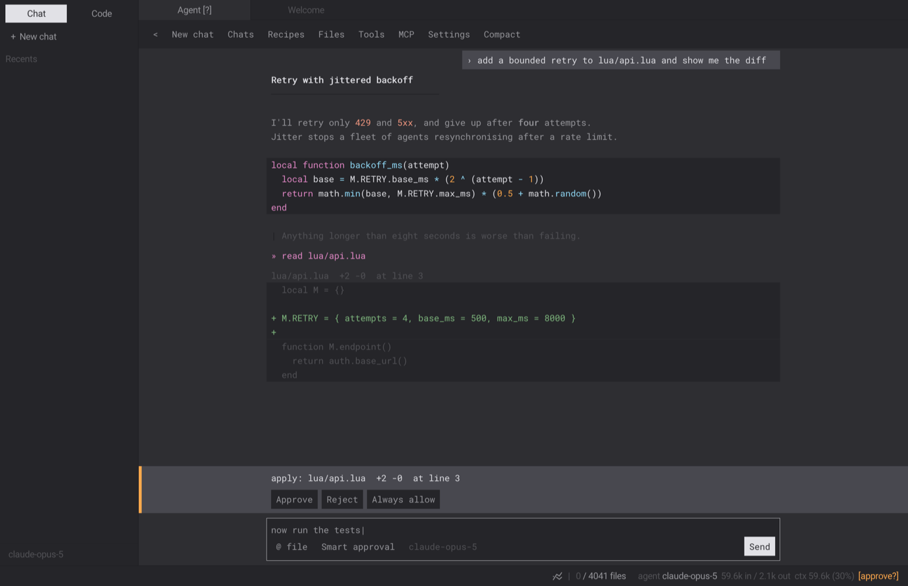
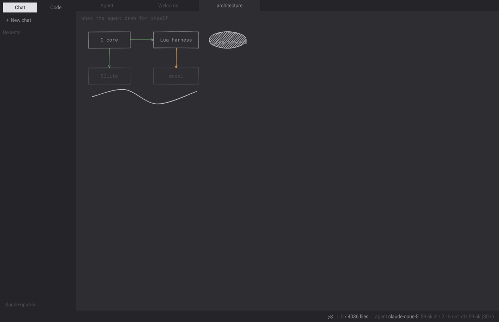
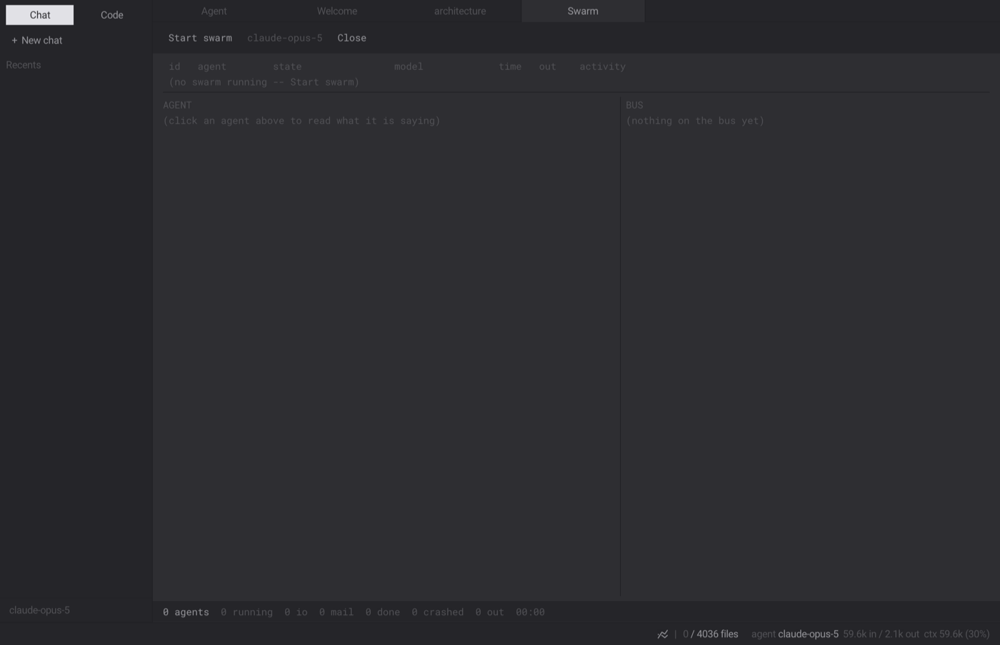
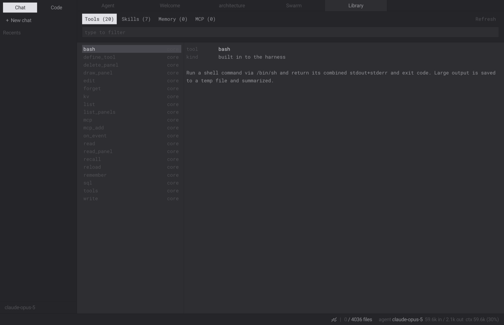

# boggart

A tiny coding agent with a C core and an **embedded Lua runtime that the agent
can rewrite at runtime**. The C side is deliberately dumb — a Lua VM, an HTTP
transport, a line editor, and the baked-in default scripts. Everything
interesting (the agent loop, the tools, the memory, the system prompt) is Lua,
and the model is encouraged to edit that Lua and hot-reload it. It ships as a
single embedded executable.

It feels like `pi` (four core tools, tight context, no product opinion) but,
unlike most harnesses, it can grow its own capabilities: give it a task and it
can write itself a new tool — and, in the desktop app, a new panel to draw the
result in.

It ships as **two front ends over one engine**: `boggart`, a terminal agent, and
`boggart-studio`, a desktop application. Not two products — the same core with a
different focus, the way an editor's CLI and its GUI are the same editor. That
is enforced rather than intended: `ninja core-parity` runs both binaries and
fails the build if the version, API surface, system prompt, limits, scopes,
paths or tools have drifted apart.



The conversation is the primary surface; files open as tabs beside it. Markdown
and syntax highlighting in the transcript, a diff for every proposed write, and
an approval gate you can answer with a button. Full Unicode: CJK, Cyrillic,
Greek, Hebrew, Arabic and Devanagari all render and measure correctly, through a
system font fallback chain.

### The agent can write the interface

boggart could already write its own tools, memory and skills. The one part it
was locked out of was the window. `draw_panel` closes that: the agent writes a
Lua `draw(ctx)` function, it is compiled into a restricted environment
(drawing, the theme and arithmetic — no io, no require, no network, no
credentials), and it appears as a tab that reloads when the file changes.



The diagram primitives are a rough.js-style sketch engine (`core/sketch.lua`),
rewritten from rough-lua as our own. Hand-drawn on purpose: a diagram a model
produces is a claim about a system, and precise vector output carries an
authority the content has not earned.

### Watching a swarm, and what the agent has learned





The library is the self-extension surface made visible: every tool the agent
wrote for itself, its scope (session, project or global), when it was defined
and at which git revision, how often it has been called and how often it failed
— plus full-text search over its memory.

## Design

Two references shaped this: antirez's **ds4** agent harness (the loop
*mechanics*) and rxi's **lite** editor, whose C+Lua core boggart-studio grew
out of and now owns outright.

- **The C core knows nothing about the LLM.** `http.request` streams bytes to a
  Lua callback; subprocesses run on the libuv loop from `lua/proc.lua`; that's
  most of it. The Anthropic client, SSE parsing, and tool loop live in `lua/api.lua`.
- **Overlay mutability.** Every module loads from `<data dir>/lua/<name>.lua`
  if present, else from the copy baked into the binary. The agent edits its own
  Lua with the ordinary `write`/`edit` tools and calls `reload` to hot-swap it;
  a syntax error keeps the old code and hands back the error.
- **Tools are data.** `define_tool` lets the model author a new tool (name,
  description, JSON schema, Lua body) that exists on the next turn and persists
  to `<data dir>/lua/tools/<name>.lua`.
- **A golden starting point.** The baked-in Lua *is* the pristine "golden" setup
  the agent forks from — `boggart init` materializes it for editing, `--reset`
  restores it. Its starting toolkit is the `gold` blessed stdlib (`gold.str`,
  `.tbl`, `.fs`, `.pp`, `.args`, `.test`, `.sh`), a global the agent and its
  tools compose instead of reinventing basics.
- **One local database.** Everything durable lives in an embedded SQLite DB at
  `<data dir>/boggart.db` (the amalgamation is vendored with FTS5, so it stays a
  single exe): memory is a full-text-searchable table, conversations are saved
  as resumable sessions, plus a key/value table and harness metadata. Exposed to
  Lua as `db.*` and to the model as the `sql` and `kv` tools.
- **Borrowed from ds4:** tool failures are normal `tool_result`s prefixed
  `Tool error:` (the model retries, nothing crashes); there is no artificial
  tool-call ceiling; big command/file output is saved to a temp file and only a
  head is returned; `edit` matches `old` exactly once and returns post-edit
  context; context pressure triggers a summarize-and-keep-tail compaction.
- **Borrowed from lite:** the `bog.try` xpcall funnel, `strict.lua` (misspelled
  globals become loud errors — invaluable for model-written Lua), and the
  `package.path` + custom-searcher overlay.

## Build

```sh
cmake -B build -G Ninja     # configure
cmake --build build         # -> ./boggart and ./boggart-studio
ctest --test-dir build      # fifteen Lua suites, each against a throwaway HOME
```

Both binaries are **genuinely self-contained**. The Lua harness, the studio's
61 Lua files and its three fonts are baked in; SDL2 is fetched at configure
time (pinned by SHA256) and linked statically. Copy `boggart-studio` alone into
an empty directory and it runs: no `data/` beside it, no `SDL2.dll`, no
`brew install sdl2`, no `libsdl2-2.0-0` package. `otool -L` shows system
frameworks and libcurl, nothing else.

`-DBOGGART_SDL_FROM_SOURCE=OFF` uses a system SDL2 instead, which is the right
choice for a distribution package: a distro wants to own and patch its own SDL.

Beyond the fifteen ctest suites there are three checks that need a window, so
they are ninja targets rather than tests:

```sh
ninja -C build ui-check      # renders nine scenarios and asserts what a frame shows
ninja -C build ui-bench      # frame-rate invariants: drawing must not scale with the transcript
ninja -C build core-parity   # the CLI and the studio are one engine
```

Requires CMake ≥ 3.20, Ninja, a C compiler, and libcurl (present in the macOS
SDK; built from source with the Schannel backend on Windows). Lua 5.5, SQLite,
cJSON, libuv, luv, ltui/PDCurses and isocline are vendored under `src/vendor/`
and built statically. The binary is written to the source root so the invocations
below work as documented; everything else stays in `build/`.

On Apple silicon the build re-signs the binary ad-hoc after linking — a stale
linker signature is what makes macOS `SIGKILL` a freshly built arm64 exe.

There is no longer a plain-`make` fallback: the build now pulls in libuv, luv,
ltui/PDCurses and isocline, all with their own flag sets, and maintaining a
second description of that by hand was a standing source of drift.

## Use

Auth: set `ANTHROPIC_API_KEY`, or log in once with the `ant` CLI (`ant auth
login`) and boggart will use that token.

```sh
./boggart                 # interactive REPL — a coordinator that can spawn a fleet
./boggart --tui           # full-screen chat: scrolling transcript + live agents pane
./boggart "one-shot task" # run a single prompt and exit
echo "task" | ./boggart --headless   # scriptable: prompt on stdin, reply on stdout
./boggart swarm           # swarm coordinator that fans out to sub-agents
./boggart swarm "task"    # one-shot multi-agent orchestration
./boggart swarm --tui     # swarm + the full-screen ltui dashboard
./boggart swarm --resume  # redeliver unprocessed journalled messages and continue
./boggart init            # copy the default Lua into the data dir to edit
./boggart --reset [file]  # revert an overlay file (or all) to the baked-in default
./boggart doctor          # check the install and say, in plain words, what is wrong
./boggart --help          # every flag, subcommand and environment variable

./boggart-studio          # the desktop app; ./boggart-studio <dir> opens a project
# BOGGART_STUDIO_LEGACY=1 restores the old single-primary-node + sidebar layout
```

The studio's composer shares the cTUI's completion engine: **Tab** completes `/` commands and skills and `@` file mentions (typing `@` opens a filterable file menu), and a leading `/command` runs the same handler the REPL uses (`/help`, `/tdd`, …). **Shift-Tab** cycles the shared permission modes (auto / smart / manual / chat).

The studio's code editor has an optional **neovim-style modal layer** (modes,
motions, operators, text objects, `:` ex-commands, search, dot-repeat,
visual-block and multi-cursor) — off by default, enabled with `config.vim_mode`,
the `vim:toggle` command, or `:set vim`. See [docs/vim.md](docs/vim.md).

These are not separate programs — they are **interfaces onto one swarm runtime**.
Every turn runs as a libuv-driven scheduler coroutine that may spawn more, so a
plain `boggart` chat is simply a swarm whose fan-out starts at one and grows when
the model decides to delegate (cap `BOGGART_MAX_AGENTS`, default 16). While a
turn's fleet is running you keep the foreground: **Ctrl-C** cancels the turn, **p**
pauses and resumes the whole fleet, **k** kills the newest sub-agent — the same
scheduler primitives the cTUI's agents pane draws.

On a new install the studio opens on a welcome screen rather than an empty
conversation it has no credentials to run: paste an API key, or point it at a
local server (`http://127.0.0.1:8000` speaks the Messages API), pick a model
from the ones that server reports, and test the connection before committing to
it. The test runs a real turn through `lua/api.lua`, so its verdicts come from
the same error taxonomy the agent itself uses.

REPL commands (Tab-completed; `/help` is generated from the registry, so it is
always current): `/help /tools /auth /doctor /memory /sessions /resume <id>
/reload /reset [file] /model /until <task> /react <task> /new /quit`. `/until`
and `/react` run turns toward a goal until it is met or a turn budget is spent
(`/until <shell-check> :: <task>` stops when the command exits 0; `/react` is
the same loop with Thought → Act → Observe prompts). `/model` shows the running model and
whether it is local or remote; `/model <id>` switches.
Swarm commands: `/help /threads /journal [n] /agents /model <id> /quit`.

### Where boggart keeps its files

One directory holds everything: the SQLite store (`boggart.db`), the credential
file (`auth`, 0600), your overlay Lua (`lua/`) and the REPL history. It is
chosen once, in C (`src/bogpaths.h`, `sys.paths()`), by this order:

1. **`$BOGGART_HOME`**, verbatim — moves the store, the credentials and the
   overlay together. A second install, a test, a shared home: one variable.
2. **An existing `~/.boggart`**, if you already have one. Boggart never
   relocates a directory you are already using.
3. Otherwise the platform location, for a new install:
   - **Linux** `$XDG_DATA_HOME/boggart`, defaulting to `~/.local/share/boggart`
   - **Windows** `%LOCALAPPDATA%\boggart` (not `%APPDATA%` — a multi-megabyte
     store with a WAL sidecar has no business roaming)
   - **macOS** `~/.boggart`, deliberately not `~/Library/Application Support`:
     this directory is the agent's own editable source and a credential file,
     i.e. things people grep, diff and back up, and a Finder-hidden path with a
     space in it is hostile to all three.

Everything in it is created on demand, on every start — directories, database,
schema. Missing pieces are the normal state of a new machine, not an error.
A database that fails `PRAGMA integrity_check` is moved aside to a timestamped
`boggart.db.corrupt-<stamp>` and recreated, loudly: sessions and memories in it
are gone, and boggart says so rather than pretending it recovered them. Nothing
is ever deleted. A store written by a *newer* boggart is refused, untouched,
with an explanation.

`boggart doctor` reports all of it — which directory and why, whether it is
writable, database size/integrity/schema, whether a credential is set **and
where it came from** (`ANTHROPIC_API_KEY` in the environment silently beats the
stored file), the endpoint, MCP servers configured versus actually connecting,
overlay files shadowing built-in modules, and free disk. It exits non-zero when
something is genuinely broken, so `boggart doctor >/dev/null || ...` works in a
script. `/doctor` prints the same report inside the REPL.

## Swarm mode — all agents are actors

A separate mode adds lightweight **agentic fan-out**. The unit is an *agent*, which
is just a conversation **session** plus its own **journal** (its slice of the
message log), a **skills** list (bundles of instructions + a permitted tool
set), a **mailbox**, and its **tool calling**. Every agent — the coordinator and
every sub-agent — is an actor on one internal pub/sub bus; they differ only by
spec and lineage. Fan-out is the coordinator spawning child agents that run
**concurrently** (async `curl_multi` plus a libuv loop under a cooperative
scheduler — no OS threads for actors) and report back.

- **Messaging machinery is in C** (`src/lswarm.c`): per-agent FIFO mailboxes,
  topic pub/sub, and a write-through **journal** to the same SQLite DB. Lua owns
  only agent *behaviour* and a ~60-line scheduler (`lua/sched.lua`).
- **Standard agents** (`lua/agents/*.lua`: coordinator, researcher, coder,
  critic) and **skills** (`lua/skills/*.lua`: core, comms, orchestrate, memory,
  data, selfmod, plus gold engineering skills like tdd / code_review / grilling)
  data, selfmod) are overlay-mutable like everything else.
- **Coordination tools**: `spawn`, `await`, `send`, `publish`, `subscribe`,
  `inbox`, `threads` — an agent only gets the tools its skills permit.
- **Durable + resumable**: agents are persisted sessions; every bus message is
  journalled with a `processed_at` stamp, so `--resume` reloads and redelivers
  anything unhandled.

There is **one runtime, not two**. The scrolling REPL, `--tui` and `swarm` all
stand it up the same way (`bog.activate_agents`) and run every turn as a
libuv-driven scheduler coroutine that can spawn more — a lone chat is a swarm
whose fan-out stayed at one. The interfaces differ (a scrolling transcript, a
full-screen cell grid, a dashboard); the engine — scheduler, bus, journal,
coordination tools — is shared, and reads its live fleet from one place
(`bog.sched.actors`), so the REPL's roster line and the cTUI's pane cannot
disagree.

## MCP (Model Context Protocol)

boggart can connect to MCP servers; the **client lives in C** (`src/lmcp.c`) and
speaks both transports — **stdio** (launches the server as a subprocess) and
**Streamable HTTP** (via libcurl). The philosophy is "MCP servers are just
tools": on connect, each server tool is registered as an ordinary tool named
`mcp__<server>__<tool>`, so it flows through the normal tool loop with no
special-casing. A thin Lua module (`mcphost.lua`) does the registration.

The differentiator is **per-agent tool management**: because MCP tools are
normal registry entries gated by skill allowlists, you can have many servers
connected while each agent sees only the slice its skills grant — a whole server
via a wildcard (`mcp__github__*`) or individual tools (`mcp__github__create_issue`).
This keeps each agent's tool surface (and context) small.

Connect servers at startup by declaring them in `~/.boggart/lua/mcp_servers.lua`
(a Lua module returning `{ {name=, command=, args=}, {name=, transport="http",
url=, headers=}, ... }`), or at runtime with the `mcp_add` tool; `mcp` lists
connected servers. v1 is tools-only (resources/prompts, OAuth, and exposing
boggart *as* an MCP server are future work).

### Two protocol generations, negotiated per server

MCP `2026-07-28` deleted the handshake. There is no `initialize`, no
`notifications/initialized` and no session: the protocol is stateless, so every
request restates the protocol version, the client's capabilities and its
identity in `params._meta`, and on HTTP mirrors its method and name into
required `Mcp-Method` / `Mcp-Name` headers. boggart speaks **both** that and the
older handshake generation (`2025-11-25` and earlier), and works out which per
connection rather than being told:

    connect -> server/discover ---- result ------> modern: pick a version from
                    |                              supportedVersions, go stateless
                    +--- spec error (-3202x) ----> modern too: retry its version,
                    |                              do NOT fall back
                    +--- any other error, or ----> legacy: initialize handshake
                         no answer at all

`server/discover` is the probe because modern servers MUST implement it and its
answer doubles as the version list. The fallback is deliberately not keyed to
one error code: legacy servers answer an unknown pre-`initialize` method with
whatever they like (`-32601` and `-32602` are both common) or with nothing.
`conn:info()` reports what was negotiated (`{era="modern"|"legacy", protocol=…}`),
and `bog.mcphost.list()` carries it per server, so `boggart doctor` and the
studio can show which generation each one is speaking.

Results in the new generation are polymorphic: `resultType` is `"complete"` or
`"input_required"`. An older server sends none, which clients must read as
`"complete"`. **boggart does not implement MRTR** (multi round-trip requests —
the server asking for an elicitation, a sampling turn or the roots list before
it can answer). It declares no client capabilities, so a conforming server has
no legal input request to make of it; if one arrives anyway the call fails with
a tool error naming what was asked for. It is never passed off as the answer —
an `input_required` result carries content blocks that read like a real reply,
and handing those to the model would be a fabrication. The `x-mcp-header`
extension (mirroring nominated tool *parameters* into `Mcp-Param-*` headers) is
also not implemented: the annotation lives in the tool's input schema, which the
Lua registration layer holds and never passes to the C client.

Verified against real third-party software, not only the mock server in
`tests/mcp.lua` (which plays either generation, over stdio or HTTP, and traces
every message it receives so the tests can assert on the wire rather than on the
client's own account of itself): connected to Chrome DevTools MCP
(`npx chrome-devtools-mcp`, which negotiates down to legacy `2025-11-25`),
which registered 29 tools as `mcp__devtools__*`; loaded a page, read the element
uid out of the accessibility snapshot, clicked a button and confirmed the page
changed as a result; then asked the model to use `mcp__devtools__list_pages`,
which it chose on its own and answered from correctly.

Default model is `claude-opus-5` (adaptive thinking; no sampling params).

## Events — autocommands for the agent

Every other extension point in boggart runs one way round: the agent calls a
tool, the agent draws a panel. `lua/events.lua` is the inversion, taken from
Neovim's autocommands — Lua **registers interest** and the harness calls it:

```lua
local events = require("events")            -- or bog.events

local h = events.on("tool:*", function(name, data)
  events.notify(name .. " " .. data.name)   -- vim.notify, both worlds
end, { desc = "trace tool calls", once = false })

events.off(h)                               -- or events.off(h.id)
events.list()                               -- every registration, in firing order
events.emit("my:event", { ... })            -- your own events are fine too
```

Patterns are **globs, not Lua patterns**: `*` is the only metacharacter
(`"tool:*"`, `"file:write"`, `"*"`). Handlers fire in registration order.

| event | payload |
| --- | --- |
| `session:created` / `session:saved` / `session:resumed` | `{ id, count }` |
| `turn:start` | `{ session, preview, chars }` — preview is the first 200 chars |
| `turn:text` | `{ session, text }` — one streamed delta (hot) |
| `turn:end` / `turn:error` | `{ session, stop }` / `{ session, message, kind }` |
| `tool:before` / `tool:after` | `{ name, input }` / `{ name, error, bytes }` |
| `tool:refused` | `{ name, reason }` — a permission gate stopped it |
| `context:compacted` | `{ session, before, after }` (chars) |
| `file:write` / `file:edit` | `{ path, bytes, lines }` |
| `swarm:actor_started` / `swarm:actor_stopped` | `{ id }` / `{ id, reason }` |
| `notify` | `{ msg, level }` |

Payloads carry identifiers and sizes, never transcripts or file contents: an
event nobody can afford to subscribe to is an event nobody subscribes to.
`events.EVENTS` is the same table, in the binary.

**Registering from your own Lua**: drop a file in `~/.boggart/lua/events/`
(*not* `~/.boggart/lua/events.lua` — that path is the overlay copy of the module
itself). Each file is called with the module as its only argument and is re-read
on every `reload`:

```lua
-- ~/.boggart/lua/events/audit.lua
local events = ...
events.on("file:*", function(ev, d)
  bog.store.kv_set("last_" .. ev, d.path)
end, { desc = "remember the last file touched" })
```

**Registering from the agent**: the `on_event` tool is `define_tool`'s mirror
image (`op = on | off | list`). Those handlers are **session-only** and
deliberately so — a persisted tool waits to be called in a conversation someone
is watching, while a persisted handler would run on every future start, on every
matching event, with no approval gate to put in front of it. Durable reactions
go through a file the user can see, which the agent may write with `write`.

**Isolation**: each handler runs in its own coroutine. Throwing affects neither
the emitter nor the other handlers (it is reported through `notify`, and five
failures unsubscribe it); yielding — `sys.exec` under the swarm scheduler —
gets the handler dropped rather than allowed to suspend the agent's turn. A
handler that loops forever still wedges the agent: bounding that needs a debug
hook, and `tools.lua` already uses the one hook slot for generated tool bodies.
Emitting with nothing subscribed costs one comparison, so the hot events
(`turn:text`) are free when nobody is listening.

## Layout

```
src/            C core: boggart.c (main), lhttp.c (curl: blocking + async multi),
                lsys.c (os), ldb.c (SQLite), lswarm.c (bus+journal),
                lmcp.c (MCP client: stdio + Streamable HTTP), embedded.c (generated)
src/vendor/     vendored Lua 5.5 + sqlite (FTS5) + cJSON + libuv + luv
                + ltui/PDCurses + isocline
studio/         boggart-studio, the desktop app: an SDL window whose main
  src/            surface is the conversation, with an editor behind it.
  data/shell/     DEFAULT window: menu bar + AGENT/EDIT/FLEET workspaces
  data/core/      agentview (chat), agentcomplete (Tab/@//), studio (commands;
                  attach() is LEGACY chrome), sidebarview (LEGACY rail),
                  widgets, recipes, diff. Default window is data/shell/;
                  BOGGART_STUDIO_LEGACY=1 restores the old layout.
lua/            the golden default harness, baked into the binary:
  boot.lua        overlay loader, wiring, hot-reload, sessions, REPL, dispatch
  api.lua         Anthropic client: shared SSE decoder + sync & async transports + turn loop
  tools.lua       read/write/edit/bash/list + define_tool/on_event/reload + sql/kv + memory
  events.lua      autocommands: on/off/emit/notify, glob patterns, <data dir>/lua/events/
  store.lua       SQLite store: memory(FTS5), sessions/threads, journal, kv, meta
  lifecycle.lua   install, first run, self-repair, `doctor` (also callable from the GUI)
  memory.lua      durable memory (backed by store) + prompt index
  prompt.lua      system prompts (single-agent discipline + swarm coordinator)
  util.lua json.lua strict.lua      helpers, JSON, undefined-global guard
  gold.lua gold/  golden stdlib: str, tbl, fs, pp, args, test, sh
  sched.lua       cooperative actor scheduler (swarm)
  thread.lua      an agent = session + journal + skills + mailbox + tools (swarm)
  skills.lua skills/    skill bundles (core, …, gold: tdd, diagnosing_bugs, code_review, …)
  agents.lua agents/    standard agents (coordinator, researcher, coder, critic)
  tools_swarm.lua swarmmode.lua      swarm tools + the swarm mode entry
  mcphost.lua     MCP glue: register server tools as mcp__<server>__<tool>
tools/          bake_embedded.cmake / bake_assets.cmake  bake lua/ and studio/data
                  into the binaries; genwidth.py generates the Unicode width table
                uishot.lua / uibench.lua                  the checks that need a window
                fingerprint.lua / parity.cmake            proof the CLI and studio agree
tests/          fifteen suites, each against a throwaway HOME. lifecycle.lua drives
                the real binary: corrupt stores, unwritable homes, doctor's exit code
docs/images/    the screenshots above, rendered by the app itself
```

## Credits & licenses

- Lua 5.5 — MIT (© Lua.org, PUC-Rio), vendored in `src/vendor/lua/`.
- SQLite — public domain, amalgamation vendored in `src/vendor/sqlite/`.
- libuv — MIT, vendored in `src/vendor/libuv/` (event loop, processes, fs).
- luv — Apache-2.0 (© the luvit authors), libuv bindings for Lua.
- ltui — Apache-2.0 (© tboox), terminal UI; PDCurses (public domain) on Windows.
- isocline — MIT (© Daan Leijen), the line editor; replaced linenoise, which
  had no Windows port.
- cJSON — MIT (© Dave Gamble), vendored in `src/vendor/`.
- SDL2 — zlib, fetched at configure time (pinned by SHA256) and linked
  statically, so `boggart-studio` has no runtime SDL dependency at all.
- stb_truetype — public domain / MIT (© Sean Barrett), the glyph rasteriser,
  vendored in `studio/src/lib/stb/`.
- **rxi/lite** — MIT (© rxi). `boggart-studio` grew out of its C+Lua editor
  core and now owns it outright: renamed, re-themed, Lua 5.5, a widget layer,
  a font fallback chain, a line primitive and a chat-first layout it never had.
  `strict.lua` and several harness patterns in the CLI come from there too.
- `core/sketch.lua` is our own implementation of the hand-drawn geometry in
  **rough.js** (MIT, © Preet Shihn), by way of **rough-lua** (MIT, © Didier
  Willis), whose port I read closely before rewriting it. Both notices are kept
  in `studio/LICENSE-rough`; the algorithms are theirs, the code is ours.
- Unicode width data derived from Unicode 16.0.0 `EastAsianWidth.txt` and
  `emoji-data.txt` by `tools/genwidth.py`, following Markus Kuhn's `wcwidth`
  rules.
- Autocommands, extmarks and `:checkhealth` are ideas taken from **Neovim**;
  the welcome screen's shape is taken from **Claude Desktop**; the workflow
  builder's from **MindStudio**. No code from any of them.
- Loop mechanics studied from antirez/ds4.

boggart itself has no `LICENSE` file yet. That is a real gap now that the
release workflow publishes binaries built from the MIT-licensed work above, and
it should be closed before the first tagged release.
