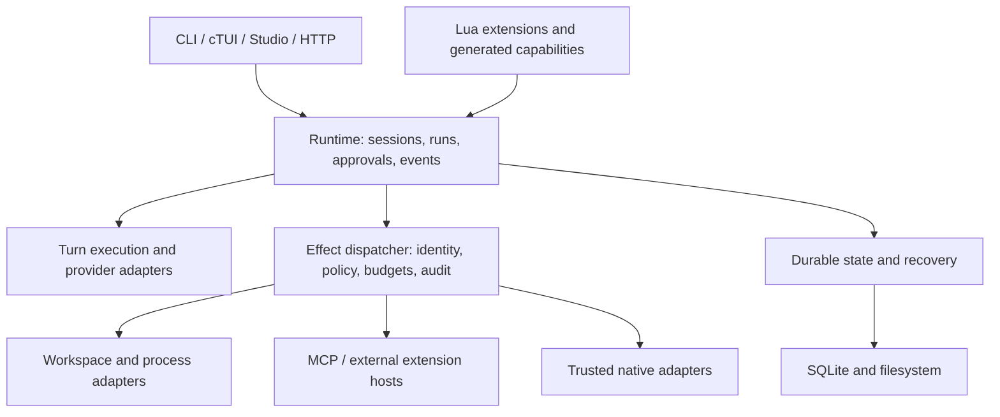

# Boggart: product, architecture and extension audit

Date: 21 September 2026. Working-tree audit, including the in-progress TypeSafe/judge additions. Base commit: `c5cde86`; reported application version: `0.2.0`.

**Direction revised after user clarification:** the central goal is process mining LLM-driven steps into executable code, with Boggart as the brain over existing LLM Station and AIbyWire capabilities. Read [the ecosystem and process-compilation roadmap](ecosystem-brain-roadmap-2026-09-21.md) for the updated ownership model and delivery sequence. The reproduced technical findings below remain applicable; the earlier standalone product framing and roadmap are superseded where they differ.

**Recommendation: build the coding workbench that turns successful work into tested, reusable capabilities.** The compelling promise is “teach it your repository once; reuse the procedure, checks and interface next time.” Self-modification is the mechanism. Less repeated explanation, faster verified work and control over what runs are the customer benefits.

Boggart already has enough machinery to demonstrate this. Its immediate constraint is confidence in that machinery, a coherent first-use experience, and evidence that reuse improves outcomes. Adding a marketplace, more planners or unrestricted DLL loading before addressing those constraints would increase the surface area faster than the product's value.

## 1. Scope and confidence

This review examined the C host, Lua runtime, tools, permissions, callables, persistence, scheduling, model transports, extension loading, Studio integration, build/release definitions, tests and existing strategy documents. It inspected a checked-in Studio screenshot; it did **not** conduct a fresh interactive GUI usability study.

Verification performed:

- Ran all **56 Lua suites listed in CMake**, each with a disposable home and the existing CLI binary. All passed after resolving environmental interference: the terminal-rendering suite needed inherited `NO_COLOR` removed; MCP and control tests needed permission to bind their local mock servers.
- Compared embedded Lua to the working tree: **141 corresponding Lua source files matched byte-for-byte**. This supports applying the Lua reproductions to this checkout; it does not establish freshness of every native object or Studio asset.
- Ran isolated probes that reproduced permission bypass, nested budget loss, failed-reload state drift, swallowed verification errors, duplicate tool events and a broken session-list route. See [audit evidence](audit-evidence-2026-09-21.md).
- Compiled and loaded a small C extension through `package.loadlib` into the current macOS CLI, including `luaL_checkversion` and a real Lua API call.
- Researched extension precedents against primary sources: [extension research](extension-research-2026-09-21.md).

Not established: fresh-build success, native memory safety, Windows/Linux runtime behavior, live provider correctness, real-task success rates, production crash recovery, current release availability, GUI accessibility or cross-platform native-extension compatibility. No paid model calls were used. No application code was changed. Existing user modifications were retained.

“Reproduced” below means an isolated local executable probe; “source finding” means directly visible in the reviewed code; “proposal” means future design, not a shipped feature.

## 2. What Boggart actually is

The README's “tiny coding agent” no longer describes its scope very well. It is a **local agent runtime and programmable workbench**, with coding as its strongest existing application.

| Layer | What exists | Why it matters |
|---|---|---|
| Native host | Lua, SQLite, curl, libuv, filesystem/process helpers, MCP, worker threads, actor messaging, HTTP/SSE control, optional native integrations | A relatively self-contained runtime with direct control over execution and distribution |
| Agent runtime | Provider wire adapters, tool loop, routing, context compaction, sessions, skills, goals, plans, actors, supervision | Substantial orchestration already exists; another orchestration abstraction is not the immediate need |
| Programmability | Overlaid Lua modules, generated tools and skills, events, callables, agent-authored panels | The user and agent can change how work is done, not only request another answer |
| State | SQLite sessions, memory/search, tool provenance and counters, records, journals and checkpoints | The foundation for inspectable reuse, recovery and measurement |
| Surfaces | CLI, cTUI, Studio and HTTP/SSE control | Multiple ways to use the engine; useful only if behavior remains consistent |

Primary anchors: [README](../README.md), [boot](../lua/boot.lua), [native registrations](../src/bogembed.c), [turn engine](../lua/api.lua), [store](../lua/store.lua), [control](../lua/control.lua), [Studio engine](../studio/data/core/engine.lua).

The architecture has a sensible basic split: C supplies difficult host capabilities, Lua supplies policy and composition, and front ends present the running work. However, the C core now does substantially more than transport and a VM, and “policy in C” does not by itself mean all effects are permission checked. Several capabilities remain broadly accessible to generated code.

## 3. Where it is unusually promising

### Reusable expertise can be executable

Tools can be created during a task, scoped, persisted, searched and measured. Skills can acquire deterministic setup, execution and verification through callables. This creates a path from “remember this instruction” to “run this repository-specific procedure.” [Tools](../lua/tools.lua), [skills](../lua/skills.lua), [callables](../lua/callable.lua).

A good example: learning how to reproduce one flaky test becomes a capability that gathers the correct logs, runs the correct target and checks the known failure signature. The next task starts with that capability instead of paying for the same exploration. That is a concrete benefit worth building around.

The existing compounding thesis is promising but unproven. Tool call counts and elapsed CPU time do not establish avoided model calls, improved success or net savings after authoring and maintenance. Nor is deterministic code automatically correct outside the examples from which it was generated. [Compounding thesis](compounding.md), [tool accounting](../lua/store.lua).

### Agent-written interface is a strong demonstration surface

The combination of a generated tool and an inspectable panel is more memorable than another chat transcript. A migration checklist, failing-test dashboard or dependency review can remain useful after the conversation. The restricted drawing environment is a worthwhile separation from host execution. [UI tools](../studio/data/core/uitools.lua), [panel environment](../studio/data/core/uisandbox.lua).

Make panels displays of real, structured results with source links and timestamps. Decorative architecture drawings alone will not establish product value. Label generated content, distinguish measured facts from model interpretation, and send every action through the same effect dispatcher as CLI tools.

### One engine across surfaces is worth preserving

The shared harness and parity target are real engineering assets. Users can begin interactively and later automate the same capability. Maintain this advantage by making the engine interface smaller and more explicit; duplicated initialization and wrappers in Studio weaken the guarantee. [Parity target](../CMakeLists.txt), [Studio engine](../studio/data/core/engine.lua).

### Operational thoughtfulness is already present

Doctor, disposable test homes, resumable transcripts, interrupted-tool markers, bounded output, scoped generated tools, cross-platform CI and packaged-binary smoke checks show attention to real failure modes. These deserve investment rather than replacement. The actor UI and telemetry also give a useful starting point for explaining what parallel work is doing.

### Low-friction distribution is strategically useful

The build aims to ship self-contained executables rather than a user-managed stack of language runtimes. Keep the base installation useful without plugins. Optional extensions can be extra files without sacrificing a self-contained default.

## 4. Product focus: who should care first?

**Initial audience hypothesis:** developers and small engineering teams with repeated repository-specific work, comfortable with local tools and willing to inspect changes. This is a recommendation to validate, not a claim about existing users.

Their job: “Do this safely in our peculiar repository, show me the evidence, and remember the procedure so I don't have to teach it again.”

Three candidate workflows:

1. **Fix a failing test:** reproduce → identify the cause → change → verify → retain a reusable reproduction/check capability.
2. **Review a change using our rules:** pin the diff → gather relevant context → run deterministic checks → use the model for judgment → produce findings tied to files and evidence.
3. **Perform a repeated migration:** identify candidates → preview edits → apply in an isolated workspace → verify → retain the migration pack and a progress panel.

Start with the first two. The third adds broader file-operation and recovery requirements and should follow trustworthy execution.

The first five minutes should show the whole loop: choose a repository, run a bounded task, see a reviewed result, save the useful procedure, run it again. A suggested welcome action should demonstrate a real capability, not merely send a generic prompt to a model.

Proposed visible concepts: **Tasks, Changes, Library, Settings**. Fleet detail belongs inside a task unless the user explicitly manages agents. Keep advanced surfaces available, but do not require users to understand actors, GOAP, callables, buses or judge backends to fix a test.

The checked-in screenshot demonstrates the custom drawing surface but has subdued contrast and large unused space; that is an observation about the artifact, not a verdict on the current application. Re-run a live first-use study on the current shell before adopting the older UI backlog wholesale.

### What would make it a killer product?

A cohesive loop:

**Ask → inspect the proposed work → execute within a budget → verify → review/undo → retain a capability → reuse it with evidence.**

The Library becomes the central differentiator. Each capability should show:

- What it does, when it applies and the authority it requires.
- Its code/version, source task, repository scope and verification evidence.
- Last successful use, failure rate, stale assumptions and dependencies.
- Reuse benefit where measured, including creation/repair costs.
- Preview, test, disable, export and rollback actions.

Do not sell automatic self-improvement as an established property yet. Sell inspectable reuse; prove the stronger claim through evaluations.

## 5. Findings requiring attention

Priorities: **P0** before recommending shared/untrusted extensions or strong permission guarantees; **P1** before a broader product launch; **P2** subsequent productization. P0 here describes product gating, not a formal vulnerability score.

| ID | Priority | Finding and evidence | Required outcome |
|---|---|---|---|
| A1 | P0 | **Nested calls bypass permission checks.** A wrapped direct `write` was denied, while an allowed generated tool calling `tools.call("write", ...)` wrote the same temporary file. `tool_env` calls raw `M.run`; callable tool wrappers do too. [tools.lua](../lua/tools.lua), [perm.lua](../lua/perm.lua) | Every effectful invocation, including nested calls, carries identity and crosses the same authorization seam |
| A2 | P0 | **Explicit tool allows can override stronger restrictions.** `perm.decide` returns early for `tool_policy`; reproduced `allow` with chat mode and a child deny rule. [perm.lua](../lua/perm.lua) | Evaluate non-negotiable denies and inherited restrictions before scoped allows; test the precedence matrix |
| A3 | P0 | **A skill verifier can reject and still return success.** `skills.as_callable` puts its verifier in `finally`; `callable.invoke` ignores failed `pcall` results from finalizers. Reproduced a `verify=function() return false end` skill returning unchecked success. [skills.lua](../lua/skills.lua), [callable.lua](../lua/callable.lua) | Verification failure becomes an unsuccessful outcome; cleanup failures remain visible; success requires explicit recovery |
| A4 | P1 | **Nested generated calls lose the outer instruction budget.** Inner `run_bounded` overwrites then clears the debug hook. A million-iteration outer loop completed with a 10,000-instruction budget after calling an inner tool. [tools.lua](../lua/tools.lua) | Preserve hooks and enforce a shared root budget through nested calls, coroutine creation and failure paths |
| A5 | P1 | **Generated event handlers are not bounded like generated tools.** `on_event` compiles restricted Lua; `events.invoke` resumes a new coroutine without a count hook. The source explicitly documents that an infinite handler wedges execution. [tools.lua](../lua/tools.lua), [events.lua](../lua/events.lua) | Bound every generated execution entry; stop/quarantine a runaway without wedging the UI or scheduler |
| A6 | P1 | **Failed reload is not a full rollback.** Snapshot keys are module names; `wire` assigns aliases such as `bog.worker` from `workers`. A later load error leaves a different `bog.worker` after failure. Shared registrations/state can also be mutated during load. [boot.lua](../lua/boot.lua) | Stage a generation and registration set before activation; specify in-flight behavior and what cannot be rolled back |
| A7 | P1 | **Control session listing returns no real sessions.** `/sessions` calls nonexistent `bog.store.sessions`; the real method is `sess_list`. Reproduced one stored session and HTTP-handler output `{"sessions":{}}`. [control.lua](../lua/control.lua), [store.lua](../lua/store.lua) | Contract test routes against populated state; represent list fields as arrays even when empty |
| A8 | P1 | **One tool call produces two `tool:before` deliveries.** Gate calls `events.ask` with `{tool,...}`, dispatcher calls `emit` with `{name,...}`. Reproduced two calls to one observer. [perm.lua](../lua/perm.lua), [tools.lua](../lua/tools.lua) | Distinct authorization and observation events, fixed payload schema, one logical delivery per stage |
| A9 | P1 | **Local service trust needs a stronger contract.** Loopback starts without a token by default; token enforcement exists when configured. Reviewed C HTTP code does not show Host/Origin validation. [control.lua](../lua/control.lua), [lserve.c](../src/lserve.c) | Authenticate by default; validate request origin/host as appropriate; test local-browser request threats. This is a source risk, not a demonstrated browser exploit |
| A10 | P1 | **“Smart” does not mean all mutations are reviewed.** Its named gate covers `write`, `edit`, `bash`; generated code receives raw `sys`, `db`, `gold`. Headless asks default to allow. [perm.lua](../lua/perm.lua), [tools.lua](../lua/tools.lua) | Define effect capabilities rather than three tool names; make unattended authorization an explicit profile |
| A11 | P2 | **Observability is not yet a reliable value measurement.** Generated-tool timing uses `os.clock`, which is CPU time rather than end-to-end wait time; tool-after emission is skipped on a trusted runner exception. [tools.lua](../lua/tools.lua) | Monotonic duration, exactly one terminal outcome, nested attribution and versioned capability metrics |
| A12 | P2 | **Documentation and release checks lag the implementation.** README says fifteen suites; there are 56 Lua suites. Direction says the daemon is missing, but control/serve exist. Studio review's opt-in-shell description is stale. Studio source warnings are broadly suppressed. [README](../README.md), [direction](direction.md), [CMake](../CMakeLists.txt) | One tested capability/status inventory; restore warnings incrementally for owned C; make GUI checks release gates |

These are not arguments to remove self-modification. They are reasons to distinguish trusted harness hacking from a supported extension system and from restricted model-authored code.

Additional limits worth making explicit:

- Filesystem guards and path globs are policy conveniences, not OS containment. Shell commands can reach beyond path-specific tool rules. Symlinks, canonical paths and child processes need tests at the actual effect seam.
- The panel instruction hook is useful, but an instruction hook alone does not cap a single large native allocation or slow native operation. Define allocator ceilings and host-call limits before treating it as hostile-code isolation.
- Lua tool environments contain shared capability/stdlib tables and metatable operations. Treat mutability and cross-extension interference as a hardening workstream; removing `io` and `require` is insufficient by itself.
- Journaled messages and resumable transcripts are not exactly-once workflows. The existing pending-tool marker correctly records ambiguous interruption rather than blindly replaying it. Future automation must preserve that honesty.
- File claims are advisory; writes still proceed after collision warnings. Use explicit isolated workspaces for parallel writers, with reviewed integration, rather than marketing claims as locking.
- README's broad Unicode claim exceeds what font fallback alone proves. CMake explicitly says there is no shaping engine. Validate shaping, bidirectional layout, IME and accessibility separately from glyph availability.

## 6. Make it modular by stabilizing the right seams

The problem is not insufficient Lua files. There are already many. The problem is that callers must know too much about global state, initialization order, permission wrappers, event payloads and reload timing.

Examples: `api.lua` is about 2,041 lines and combines multiple wire formats with turn execution; `boot.lua` is about 1,714 lines; `tools.lua` about 1,585; Studio `agentview.lua` about 3,074. These sizes are navigation signals, not defects in themselves. The stronger evidence is the cross-file contracts failing in A1, A3, A6 and A8.

Aim for deep modules: small interfaces hiding the difficult behavior. Avoid one-line abstraction layers that merely rename existing globals.



This is a target dependency direction, not a claim about current isolation.

| Module | Small interface to establish | Complexity it should hide |
|---|---|---|
| Runtime | Start/cancel a run, answer an approval, inspect state, subscribe to events | Actor scheduling, attribution, lifecycle and surface-independent execution |
| Effects | Invoke a named capability with immutable execution context | Policy, grants, budgets, cancellation, validation, audit, result shaping, nested-call inheritance |
| Providers | Stream a canonical request into canonical events; report capabilities | Anthropic/OpenAI/Responses encoding, retries, auth and model-specific constraints |
| Workspace | Preview/apply/revert a changeset; create an isolated task workspace | Claims, baselines, worktrees, conflict detection and preserving pre-existing user edits |
| Extensions | Discover/validate/activate/deactivate an owned generation | Namespaces, dependencies, disposal, version compatibility and diagnostics |
| State | Persist/replay a run; read/write versioned extension-owned state | SQLite schema, migration, retention, recovery and project scoping |
| UI contributions | Register a view/command; render structured data; request an action | CLI fallbacks, Studio attachment, generated panel limits and lifecycle cleanup |

Start with **Effects** because it repairs correctness and becomes the extension seam. The execution context should carry principal, root run, parent invocation, project/workspace, effective grants, budget/deadline and cancellation. It must survive nested Lua calls, callables, MCP dispatch, events and native adapters. Inheritance may narrow authority; it must not silently widen it.

Move provider conversions out of `api.lua` behind existing scripted-transport tests. Keep routing selection outside adapters. Do not change provider wire behavior while extracting it.

Replace Studio monkey-patches of logging/`run_on` with subscriptions to typed runtime events. Have CLI and Studio call one initialization/lifecycle interface. Fingerprint parity is useful, but must be complemented by the same scripted interaction producing equivalent outcomes across surfaces.

Replace string-prefixed internal failures gradually with a structured result: success/value or error kind/message/retryability, plus artifacts and usage. Keep the current `Tool error:` formatting at the model-facing adapter during migration. Otherwise fallback composition cannot distinguish “try a different provider” from “the user denied this action.”

## 7. Lua extension design

**Default: Lua packages using a small, versioned host interface.** Existing tools, skills, events and panels remain the execution substrate; packaging gives them identity, lifecycle and compatibility rather than introducing another workflow language.

Separate three trust categories in the product:

1. Generated/restricted capabilities: no raw host globals, only granted effect wrappers, bounded execution.
2. Explicitly installed trusted Lua extensions: documented authority and owned lifecycle. Same-process Lua is not a hard security boundary.
3. Harness overrides: expert mode for replacing internals; clearly outside the stable extension contract and recoverable through safe mode/reset.

A minimal package layout could be:

```text
acme.test-triage/
  extension.json
  init.lua
  tools/
  panels/
  tests/
```

Proposed manifest, not an existing format:

```json
{
  "id": "acme.test-triage",
  "version": "0.1.0",
  "api": "^1.0",
  "lua": "5.5",
  "entry": "init.lua",
  "surfaces": ["cli", "studio"],
  "capabilities": ["workspace.read", "process.test"],
  "activation": ["command:triage-tests"]
}
```

Capability names are illustrative. For example, `process.test` only means something if the host constrains the executable, arguments, environment and workspace; it must not secretly mean arbitrary shell access.

The host supplies `activate(ctx)` with registration functions, scoped storage, logging, capability invocation and optional UI contributions. Every registration returns a disposer and belongs to `(extension_id, generation)`. Disabling an extension disposes its handlers, commands, views, watchers and pending work. Namespace tool IDs to prevent one extension replacing another silently.

Prefer data-only manifests, with validation before executing code. Pin package versions and hashes per project. Avoid auto-executing extensions from a newly opened checkout. Present requested capabilities and their changes on upgrade. Begin with local install/export and reproducible packages; a public registry can wait.

### Reload semantics

Specify reload as a lifecycle operation:

1. Read and validate the new version; compile without effects.
2. Stage registrations and versioned state migration.
3. Run checks under the declared permissions.
4. Activate at a safe point; new calls use the new generation.
5. Let old calls finish under the old generation, or explicitly cancel them.
6. Dispose old resources only when no calls reference them.

If validation fails, retain the old generation. If an activation hook performs an external action, no registry rollback can undo it automatically. Prohibit such effects during staging or require an explicit compensating operation. Test 100 reloads for handler/resource leaks and deliberately failed activation for retention of the previous version.

Overlay upgrade behavior needs the same attention: record the original embedded version/hash, detect modified and stale overrides, offer a diff or merge, and provide startup with all third-party/overlay code disabled. `init` materializing the whole harness should be an expert operation, not the recommended extension workflow.

## 8. DLLs, shared libraries and external hosts

The answer is **yes to native extension capability, but do not make DLLs the normal customization route**.

| Route | Good use | Tradeoff | Recommendation |
|---|---|---|---|
| Lua | Tools, workflows, routing policy, lightweight transforms, UI | Needs a stable host contract and execution limits | Primary extension path |
| MCP subprocess/service | Existing Python/Rust/C++ tooling, remote systems, independent dependencies | Serialization, protocol lifecycle, process supervision | Default integration path for substantial external capability |
| Lua C module | Compact trusted native capability needing low call overhead | Tied to Lua ABI and platform packaging; a crash affects the host | Optional advanced tier after compatibility probes |
| Boggart C ABI | Independent native SDK, non-Lua consumers, carefully controlled stable types | A second long-lived interface to maintain | Add only for concrete requirements unmet by the above |

The macOS probe demonstrates that native loading is already possible in this CLI build. It does **not** prove Windows DLL import libraries, Linux executable exports, Studio loading, packaging or upgrade behavior. Lua versions differ in ABI; the extension research documents the primary-source version policy.

For initial native support, publish exact headers/build recipes, OS/architecture targets, module naming rules, version checks, allocator ownership, Lua-thread affinity and error conventions. A native module must not bring its own Lua runtime and use the host's `lua_State` with it. Never let a native worker call the main Lua state from another thread; send results back through the host scheduler.

If a Boggart-specific ABI becomes necessary, use a C entry point such as `boggart_extension_init_v1`, a versioned function table with `abi_version` and `struct_size`, opaque handles, explicit buffer ownership, cancellation and an agreed result encoding. Do not expose internal C structs, C++ STL objects, Lua implementation details or SQLite handles as a stable ABI. An incompatible plugin should fail before activation with a useful diagnostic.

Require restart for native upgrades initially. Unloading code while userdata finalizers, callbacks or threads still reference it is a much harder problem than loading it. Most customers will value reliable upgrades more than native hot reload.

For untrusted or crash-prone native work, prefer a supervised external process. Process separation provides fault containment, not automatic filesystem/network isolation; add OS restrictions when making a security promise. Load approved binaries from explicit package paths, not the current directory or an uncontrolled search path.

Useful first extractions are already present: voice, LLM Station and the in-progress TypeSafe integration. Pilot one as a Lua/MCP-backed pack and one as a native adapter only if measured latency or library integration justifies it. Do not move core SQLite or basic process execution out merely to demonstrate extensibility.

## 9. Reliability, security and testing program

The broad Lua test suite is a strength. The reproduced failures show why more happy-path assertions are not enough: permissions, verification and reload fail at composition points between individually tested modules.

Required tests should follow user-visible invariants:

- Denied effects remain denied through generated tools, callables, handlers, MCP, native adapters and sub-agents.
- A failed verification can never become success merely because a cleanup handler threw.
- Nested work shares budgets; cancellation reaches processes and children; the UI remains usable.
- Every invocation has one terminal result/event; event contracts are versioned and field-consistent.
- An interrupted write is reported as uncertain where appropriate; resume does not duplicate an external side effect.
- Reload either activates a complete generation or leaves the prior one usable.
- A changeset preserves unrelated dirty files and detects a changed baseline before application.

Add native sanitizer runs and targeted parser fuzzing for HTTP/SSE, MCP framing, JSON/wire translation, terminal escape handling and the new binary codec. Broadly suppressing warnings in owned Studio C works against that effort. Restore warnings incrementally rather than making every historical warning a launch blocker.

Run GUI checks on the default shell, not only legacy composition. Include first paint, typing/IME, approval, cancellation, long output, extension failure and degraded network. The current `ui-check` target explicitly selects legacy mode; the other UI targets help but are not a substitute for a release-gated default-shell journey.

Make release artifacts traceable to the source, dependency versions and verification results. Add checksums, platform-appropriate signing/distribution work and upgrade/rollback tests. Review the runner/toolchain matrix periodically; do not assume the existing CI configuration proves today's downloads work.

## 10. The compounding claim needs an evaluation, not a counter

Build a small repository-task evaluation set with independent success checks. Include unfamiliar repositories and changed versions of familiar repositories. Use four conditions:

1. Base harness without retained capabilities.
2. Memory/instructions only.
3. Frozen, previously verified capability pack.
4. Capability creation plus subsequent reuse, charging creation and repair to the total.

Hold model, task snapshot, permissions and budgets constant where possible. Counterbalance task order; repeat enough runs to report variance. Evaluate novel variants separately from exact repeats so memorizing one fixture does not look like generalization.

Measure verified task completion, false-success rate, human interventions, wall time, input/output/cache tokens, monetary cost using the actual route's pricing, and capability maintenance burden. Track pack version and applicability checks. A reuse policy should fall back when preconditions are unmet rather than confidently applying stale procedures.

Start promotion manually: draft → test → review → enable → observe → retire. Add automatic proposal generation later. Do not promote on an uncalibrated model-confidence number alone. The judge integration can help rank or route work, but should not silently replace deterministic success checks or permission enforcement.

## 11. Roadmap and decision gates

The following windows are planning estimates for a small focused team, not commitments. Sequence matters more than calendar precision. Cross-platform isolation and a public native SDK can expand substantially.

| Stage | Indicative window | Deliverable | Exit gate |
|---|---|---|---|
| 0 — Trust baseline | Weeks 1–2 | Fix A1–A8; document authorization modes; establish invariant tests and a current capability inventory | The isolated reproductions fail safely; negative composition tests pass; no verifier false success |
| 1 — One excellent task loop | Weeks 3–6 | First-run workflow, proposed changes, verification evidence, review/undo, budgets and an actionable Library entry | At least 8 of 10 recruited target users finish the chosen first workflow without maintainer help; record all interventions |
| 2 — Supported Lua extensions | Weeks 7–10 | Effects interface, minimal manifest/SDK, owned registrations, staging/disposal, safe mode, export/install | Two real packs work in CLI and Studio; failed activation preserves the prior generation; repeated reload leaks no owned registrations |
| 3 — Demonstrated reuse | Weeks 11–14 | Evaluation harness, versioned capability provenance, promotion/retirement, shared pack pilot | Proposed target: at least 25% lower median end-to-end cost or time on held-out repeated task shapes, without lower verified success; report sample size and uncertainty |
| 4 — Team workflows | After evidence | Private pack distribution, review/approval, reproducible environments, CI/headless use, durable recovery | Several pilot teams reuse capabilities across people and repository updates; support burden and permission model remain manageable |
| 5 — Native SDK / ecosystem | Demand-driven | Published compatibility matrix, SDK and packaging; registry only if justified | A measured need cannot be met adequately with Lua or MCP; both front ends and every advertised native platform pass compatibility tests |

Stages 1 and 2 can overlap once the execution contract is stable. Product interviews and task evaluations should start during Stage 0. Do not wait for a complete architectural refactor before showing the task loop to users.

### First ten concrete work items

| Order | Work item | Acceptance condition |
|---|---|---|
| 1 | Centralize gated invocation | The exact nested-write probe is refused; direct and nested calls preserve principal and policy |
| 2 | Repair permission precedence | Chat mode and child denies remain effective despite previously approved tools |
| 3 | Repair callable verification/finalization | False skill verification fails; cleanup errors are surfaced without losing the primary failure |
| 4 | Make execution budgets compositional | Nested calls, handler execution and coroutine paths cannot silently remove the root budget |
| 5 | Fix reload rollback and scope its promise | Failed reload restores all advertised bindings; registration changes stage before publication |
| 6 | Normalize event stages and results | One permission request, one start, one terminal outcome with stable fields |
| 7 | Fix/populate control contracts | `/sessions` returns created sessions and empty arrays correctly; all routes have stateful contract tests |
| 8 | Define the default authorization story | Interactive/headless profiles agree on granted effects; local service authentication is explicit and tested |
| 9 | Ship one “fix and remember” journey | A user can review the fix, its verification and the resulting reusable capability from one task |
| 10 | Pilot two extension packages | Reuse existing extension points; prove lifecycle, permissions and CLI/Studio behavior before widening the SDK |

## 12. Product and commercial choices

Treat the following as hypotheses to test with users, not settled market findings.

The defensible asset would be a team's library of verified repository procedures, their provenance and the reliable runtime that executes them. A larger number of tools, more agents or self-modifying source alone is easy to demonstrate and hard to monetize.

A plausible paid offering is private capability distribution, team review/governance, shared evaluations, managed updates and support. Keep local execution and export useful so teams can adopt it without surrendering their workflow. Validate willingness to pay before building billing or a hosted management plane.

The repository uses BSL terms. Decide and clearly document the extension SDK's own license and the intended commercial extension story; obtain appropriate review before presenting compatibility guarantees. An ecosystem strategy depends on contributors understanding what they may distribute. This audit does not determine legal compatibility of third-party packages.

Defer a general business-process platform, public marketplace, full editor replacement, phone client and additional planning engines. The runtime may support those later; each adds onboarding, reliability and support obligations before the coding workflow has proved retention.

## 13. What to keep, simplify and stop claiming

**Keep:** Lua as the primary programmable substrate; a self-contained base install; one engine; inspectable local state; generated tools and panels; practical diagnostics; strong output shaping and interruption handling.

**Simplify:** user-visible concepts; global initialization; duplicated front-end lifecycle; overlapping workflow abstractions; stringly typed internal errors; extension access to raw runtime state; the number of documents claiming to be the roadmap.

**Stop claiming without qualification:** every composed capability crosses the gate; failed reload always keeps all old code/state; a failed skill verifier rejects the result; font fallback means complete international text support; existing journal/replay means exactly-once durable workflows; current counters prove compounding gains.

The product opportunity is substantial if Boggart can make one thing trustworthy and obvious: **successful work becomes a capability the user can understand, verify, reuse and revoke.** Build the roadmap around that result.
