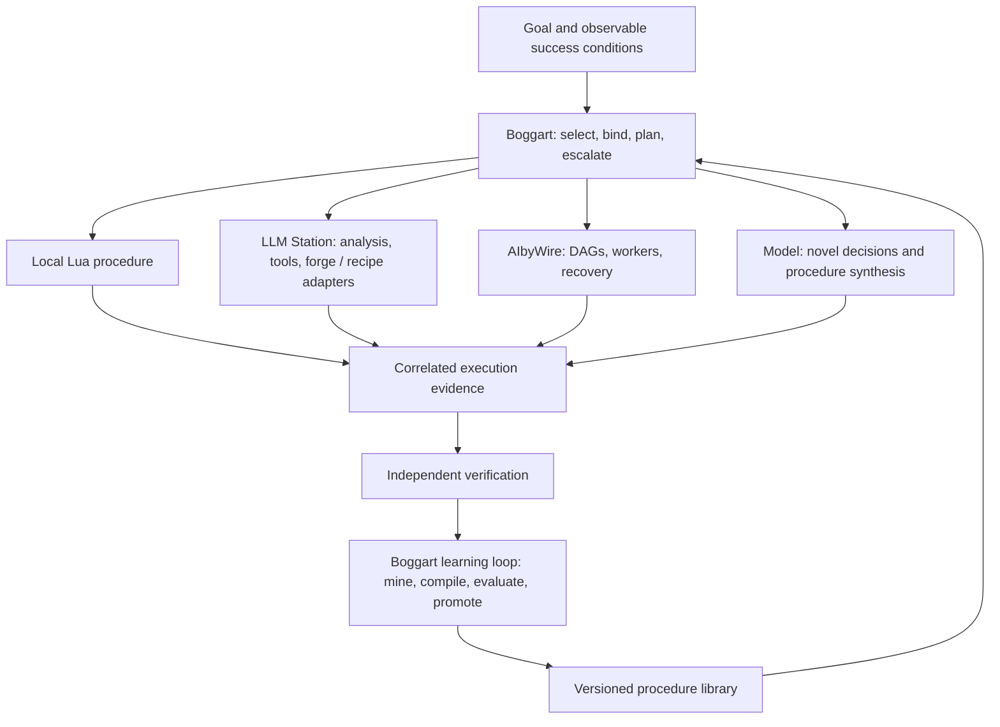

# Boggart as the brain: process compilation across the existing ecosystem

This revises the product direction in the [initial audit](audit-roadmap-2026-09-21.md) following two clarifications: **the core goal is mining LLM-driven steps into executable code over time**, and **LLM Station and AIbyWire already provide substantial tooling and execution machinery**.

The initial audit's reproduced Boggart defects still apply. Its product sequencing should now be read through this document: process compilation and cheap verified execution are the centre; a coding workbench is one useful delivery surface and evaluation domain.

## 1. The architectural conclusion

**Boggart should own the learning and decision loop. LLM Station should supply specialist intelligence and reusable deterministic capabilities. AIbyWire should supply distributed execution and recovery where needed.**

“Brain” is meaningful if it has specific ownership:

- Understand the current goal and its success conditions.
- Discover applicable procedures and bind their inputs.
- Choose deterministic execution, a small judgment call, or exploratory model work.
- Observe results and request independently checkable verification.
- Mine recurring processes, compile candidates, evaluate them and decide which versions become eligible for reuse.
- Handle exceptions and improve the procedure without losing the execution's provenance.

It does not require Boggart to implement every tool, maintain every index, dispatch every remote worker or become a single point through which every data payload travels.

This is a distillation of the other projects in a concrete sense: Boggart can provide one programmable place for the decisions that their larger runtimes currently make in several places.

## 2. What is already present

This was a **targeted source review**, not a full audit or test run of either sibling repository. Local implementation was preferred over README maturity claims. Some maps and comments are stale or internally inconsistent, so the existence of a class or protocol field is not presented as proof of production behavior.

### LLM Station: much more than a tool server

The reviewed source contains a direct precursor of the intended process-learning loop:

| Existing part | Actual role visible in source |
|---|---|
| [ActionCapture](/Users/bengamble/llm-station/src/forge/ActionCapture.cpp) | Records per-session tool calls and results and flushes an ActionTrace |
| [Forger](/Users/bengamble/llm-station/src/forge/Forger.cpp) | Extracts candidate parameters, creates action templates, groups traces and refines templates |
| [ForgeTypes](/Users/bengamble/llm-station/src/forge/ForgeTypes.h) | Models parameters, steps, preconditions, effects, provenance, status and execution statistics |
| [ForgeExecutor](/Users/bengamble/llm-station/src/forge/ForgeExecutor.cpp) | Validates parameters, checks preconditions, renders arguments and runs tools through the registry |
| [Ralph execution](/Users/bengamble/llm-station/src/ralph/RalphExecutionActions.cpp) | Wires capture callbacks and has an opt-in template-first path with historical/judge selection and LLM fallback |
| [Ralph verification](/Users/bengamble/llm-station/src/ralph/RalphVerificationActions.cpp) | Crystallizes a captured trace after task verification passes |
| [Recipes](/Users/bengamble/llm-station/src/recipe/RecipeExecutor.cpp) | Provides a parameterized pre-step → agent → verification execution form |
| [StepExecutor](/Users/bengamble/llm-station/src/agent/StepExecutor.h) | Encodes a deterministic coding pipeline with focused model generation and verification |

The forge subsystem is not just curated scaffolding, though it also includes that. There are implemented capture, crystallization, storage and execution paths, and tests for parts of the lifecycle. The reviewed tests include trace-to-search discovery; that does not establish faithful replay of arbitrary captured actions.

Boggart already has a Station integration seam: [stationlink.lua](../lua/stationlink.lua), [lstation.c](../src/lstation.c) and [llmstation.lua](../lua/llmstation.lua). Native ZMQ is preferred when available; MCP can also expose the tool registry under the documented transport policy. Extend that connection before inventing a replacement transport or embedding the entire Station codebase in Boggart.

### AIbyWire: execution, dataflow and recovery

The current root README describes an embeddable toolkit and wire protocol, rather than requiring a monolithic hosted platform. The implementation offers useful building blocks:

- [ToolSchema](/Users/bengamble/aibywire/taskengine/tools/schema.py): input/output schemas, preconditions, effects, approvals, capabilities, cost and compensation.
- [DAG model](/Users/bengamble/aibywire/taskengine/dag/model.py): dependencies, input references, retries, timeouts, approval state, idempotency keys, placement and dynamic steps.
- [DAG executor](/Users/bengamble/aibywire/taskengine/dag/executor.py): ready-node dispatch, result propagation, checkpoints, approval handling, dynamic-step injection and compensation.
- [HTN decomposer](/Users/bengamble/aibywire/taskengine/htn/decomposer.py): turns higher-level tasks and methods into a DAG.
- [DurableRuntime](/Users/bengamble/aibywire/taskengine/durable/runtime.py): an existing interface for runtime choice and advertised execution capabilities.
- [LearningModule](/Users/bengamble/aibywire/taskengine/agentic/learning.py): experience records, success statistics, utility adjustment and action-cost estimates.
- Polyglot worker/controller implementations and gateways; capability parity must be verified per chosen backend.

That LearningModule is relevant to selecting among known actions, but it is **not by itself a trace-to-code compiler**. Its “experience replay” means learning from buffered experiences; distinguish that from executing a learned procedure again.

The DAG journal stores a full state snapshot, not a complete append-only mining trace. Execution recovery and learning history need related but distinct records.

### Boggart: the programmable coordinator

Boggart brings the embedded Lua substrate, model/tool loop, generated capabilities, callables, goals, skills, local state and interactive surfaces. These make it a good place to experiment with process extraction and residual model decisions without rebuilding a C++ pipeline for every change.

The missing integration is not simply “more tools.” It is a shared meaning for **capability, invocation, observed result, verified outcome and learned procedure**, with ownership of the learning loop.

## 3. Important gaps in the existing compilation path

These are source findings in the inspected implementation; they were not dynamically reproduced in this review.

1. **Capture loses data needed for mining.** `ActionCapture::serializeResults` stores tool name, success and output length, rather than the output values or durable artifact references. `onToolCall` builds JSON by concatenating unescaped parameter keys/values. Code containing quotes or newlines can therefore produce malformed captured JSON. Record structured values with a real encoder; use redacted/artifact-backed results rather than dropping their meaning.

2. **The extracted template is not yet a faithful executable trace.** `Forger::templatizeSteps` builds a value-to-parameter map, then creates steps with order and tool name, but does not populate `fixed_args` or `template_args`. The executor later relies on those maps. Fix parameter/dataflow preservation before treating these candidates as replayable programs.

3. **Multi-trace mining is currently description grouping.** `autoCrystallize` groups by keyword/Jaccard similarity and crystallizes the first trace. It does not align action sequences, discover common dataflow, infer branches or distinguish necessary steps from exploratory detours. Description similarity is a candidate-retrieval heuristic, not evidence of process equivalence.

4. **Applicability can fail open.** `ForgeExecutor::checkSinglePrecondition` returns true for unknown precondition types and for symbol checks without an indexer. A missing checker should make eligibility unknown/ineligible, with model fallback or human review. It should not count as a passed check.

5. **Template selection and parameter binding are separate problems.** Ralph's template-first call supplies template ID and workspace. The reviewed call does not bind new task-specific parameters. A good match score does not supply a safe new file path or the dataflow values a procedure needs.

6. **Recovery primitives still need adversarial validation.** AIbyWire's Python idempotency checker explicitly uses a read-then-write sequence rather than an atomic claim. Concurrent initial submissions can both proceed. Its presence is useful groundwork, not a guarantee of exactly-once effects.

7. **Boggart's composition guarantees need repair before reuse is automated.** The initial audit reproduced nested permission bypass, swallowed skill-verifier failure, loss of outer instruction budgets and incomplete reload rollback. A learning loop can amplify these defects by reusing the same flawed procedure repeatedly.

These findings change the investment decision: improve and connect the existing compiler/executor pieces, rather than starting another general orchestration framework.

## 4. One learning owner, multiple execution adapters

The model is one resource the brain uses. Compiled procedures and deterministic analysis are also part of the brain's behavior.

Avoid three top-level planners independently pursuing the same goal. Station's Ralph and AIbyWire's orchestration can remain available as explicitly delegated, bounded capabilities. Each delegated run needs its own ID, budget, cancellation contract and returned evidence. The parent must know whether it delegated a single deterministic tool or launched another agent.

Avoid two durable engines both owning retries for the same effect. If AIbyWire owns a DAG, it owns that DAG's task retry/compensation state. Boggart records the delegated run ID and observes or reconnects to it; it does not resubmit merely because its client timed out. A fallback after a possibly completed write needs reconciliation, not automatic re-execution.

Keep a standalone Boggart useful. Use Station when its specialist analysis is needed; use AIbyWire when worker placement, independent services or durable distributed execution justify it. Do not require three daemons to run a local pure-Lua procedure.

## 5. The shared contracts to build first

### Capability descriptor

Start from AIbyWire's ToolSchema and map Station/Boggart descriptors into it. Extend only where an actual process needs more detail: version, effect category, execution target, verification interface, and idempotency/reconciliation semantics. Keep existing tools working through adapters; do not rename every tool first.

### Invocation evidence

Each observed action needs a stable `run_id`, `step_id`, parent/dependency IDs, attempt ID, capability ID/version, typed inputs, result or artifact references, failure classification, timings, usage, permission decision and verifier result. Distinguish initiation, completion and uncertain completion.

Record relevant environment facts such as repository revision, tool version and artifact hashes. Store secrets as references; avoid turning trace capture into a credential archive. Mining needs observable decisions and actions, not private model reasoning.

### Learned procedure

A procedure needs:

- Versioned inputs, outputs, preconditions and applicability checks.
- Steps with explicit input bindings, result references and branch conditions.
- Deterministic code and explicit model-decision steps.
- Required capabilities, effects, budgets and recovery policy.
- Verifiers, source trace IDs, evaluations and promotion state.

Lua should be the executable language for local behavior. A small serializable procedure description should preserve cross-step structure and bindings so the same work can be inspected, mined and lowered into AIbyWire DAGs. This is a representation for interchange and analysis, not a new general-purpose language.

Do not try to compile arbitrary Lua transparently into a distributed DAG. Mark delegatable steps explicitly; retain local orchestration for dynamic behavior that the selected runtime cannot express. Keep structured metadata alongside executable Lua so compilation does not make future mining harder.

## 6. Three different meanings of replay

| Mode | Meaning | Required rule |
|---|---|---|
| Fresh execution | Apply a learned procedure to current inputs | Bind new inputs and check applicability; execute current effects |
| Resume/recovery | Continue the same interrupted logical run | Preserve run/step identities and reconcile uncertain effects |
| Cached-result reuse | Return a prior result without executing | Validate dependencies, freshness and cache eligibility |

Use separate terms in interfaces and metrics. A cached result for a pure code search is different from resuming a payment/posting task or executing a migration on a new repository revision.

The target is also broader than macros. Replace the decision to select logs, construct queries or interpret a known status with deterministic logic when that decision can be captured and checked. Retain model calls for unresolved decisions. The useful unit is often a repeatable fragment rather than an entire task.

## 7. Revised roadmap: connect a complete learning cycle

### First milestone: a process that gets cheaper on its second distinct input

Pick one narrow process with deterministic verification. For example: identify a test target from an error, gather related symbols with Station, run the reproduction, summarize evidence, and check that the reproduced failure matches the requested case. Keep the novel repair decision model-driven initially.

Demonstrate:

1. Boggart performs the first run using current tools and records complete, correlated evidence.
2. It proposes a parameterized Lua procedure for the stable fragment, reusing/repairing Station's capture and forge concepts.
3. The candidate runs on isolated recorded fixtures and then a held-out live input with independent checks.
4. The second task uses fewer model decisions while meeting the same success conditions.
5. A changed environment causes a clean applicability rejection, not a confident wrong execution.

This is a stronger first milestone than installing a plugin or producing a template that merely appears in search.

### Work sequence

| Order | Work | Reuse rather than rebuild | Exit evidence |
|---|---|---|---|
| 1 | Restore trust in effects and verification | Boggart's existing gate, callables and limits | Earlier audit probes fail safely; denial and verification survive composition |
| 2 | Preserve trace arguments, results and correlation | Station ActionCapture plus Boggart records/events | Quotes/newlines/nested values round-trip; concurrent invocations remain distinguishable |
| 3 | Make one trace compile faithfully | Station Forger/ForgeTypes; Boggart Lua tools/callables | All required arguments and result bindings survive compilation and execution |
| 4 | Separate selection, binding and verification | Forge search, judge, schema checks and Station analysis | Wrong-task matches are rejected; parameters bind from current inputs |
| 5 | Add guarded local execution and model fallback | Existing Boggart loop and Station integration | Held-out task succeeds more cheaply; partial-effect failure is reconciled |
| 6 | Delegate one procedure to AIbyWire | Existing ToolSchema, DAG and DurableRuntime | Submission, status, cancel and reconnect share one logical run; no duplicate effects |
| 7 | Mine across traces and promote versions | Existing stores/statistics plus structural alignment | Generalized procedure works across multiple inputs; independent evaluation gates promotion |

The AIbyWire adapter can be developed alongside local mining, but distributed execution is not a prerequisite for proving compilation gains. Conversely, do not rebuild distributed reliability inside Boggart merely to keep all code in one language.

## 8. How the Lua/DLL recommendation changes

Lua is now explicitly the target for executable learned behavior. Extension packaging remains useful for versioning and distribution, but it is supporting infrastructure rather than the first product milestone.

Use existing process interfaces for Station and AIbyWire first. A native module is justified when a measured requirement needs low-overhead access to a host library. It is not necessary simply because a useful implementation happens to be C++ or Rust. That keeps their dependencies, failure modes and release cadence separate.

Boggart's native extension experiment from the initial audit still matters: a small native module loaded successfully into the current macOS CLI. It establishes a technical option, not a reason to move Station wholesale into the process.

## 9. What the user should see

The product should make learning observable:

> “This run used procedure v3 for evidence collection and reproduction. Two unfamiliar decisions went to the model. Verification passed. The new variant is a candidate improvement, not yet active.”

Show which steps were learned, why the procedure applied, what remained model-driven, and the actual end-to-end cost. Offer inspect, disable, compare and rollback. Do not claim savings merely because a tool executed quickly: include discovery, judgment, compilation, evaluation and repairs.

The central metric is **total cost per independently verified outcome as related tasks accumulate**. Also track model decisions per outcome, applicability precision, fallback frequency, false success, human repair time and recovery correctness.

The revised product thesis is: **Boggart observes how work is done, compiles the repeatable parts, and coordinates their verified execution across the tools and runtimes already available.**

## Review limits

No code in LLM Station or AIbyWire was changed, no service was launched, and their test suites were not run. Source wiring was inspected for the paths named above; this is not an assertion that every documented integration or every language runtime has equivalent behavior. Source links refer to the sibling checkouts on this machine.
